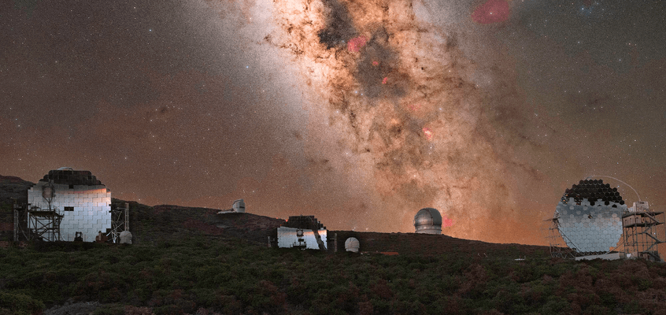

  

    <h2> Maurício Witter 🍀 </h2>
     Software Developer | Free and open-source software enthusiast 
  

  

    
  

      
  

    <blockquote>
        <i>An avid learner with a passion for the complexities of software development and a deep interest in the fascinating world of software engineering and Ο(algorithms), always eager to explore new ideas and technologies. 🐧 🦀 </i>
    </blockquote>
  

  

  

  
  About me :fist_raised: :point_left: 

  ---

  Hey there!! I am Maurício, aka [**@rwietter**](https://rwietterc.xyz/) :wave:

  I adopt the philosophy "**Learn in Public**" and with that, everything I learn, I tend to translate in a simple way to the public. I love writing about software engineering and technology on my website [rwietter](https://rwietterc.xyz/) and [substack](https://rwietter.substack.com/)

  I have experience with Dev-Ops, Distributed Systems Development, and Back-end APIs. My main knowledge in technologies are **Typescript**, **Node**, **Docker**, **React**, **Svelte**. I am also comfortable using **Vue**, **Rust**, and **Java**.

  My main abilities include designing pretty library APIs, applying software testing methodologies, API modeling following software design principles, and refactoring clunky code into nice abstractions.

      
  

  

    
 Anything else :electron: :computer: 

    

      
    

    
<strong>18/07/2023: </strong> 🌕 New Moon (0.025)

    
<strong>OS: </strong> Arch Linux
 ● Kernel v6.4.3

    
<strong>Shell: </strong> SH

    
<strong>Uptime: </strong> up 1 day, 23 hours, 6 minutes

    
<strong>Used Mem: </strong> 9,0Gi

    
<strong>Last commit: </strong> main 6 hours ago

  

    

    <h4>Astronomy Picture of the Day | <a href=https://apod.nasa.gov/apod/image/2307/MwLaPalma_Rosadzinski_2000.jpg>Milky Way above La Palma Observatory</a></h4>
    
  

  

  

  

  
  
  
  
  

  

  